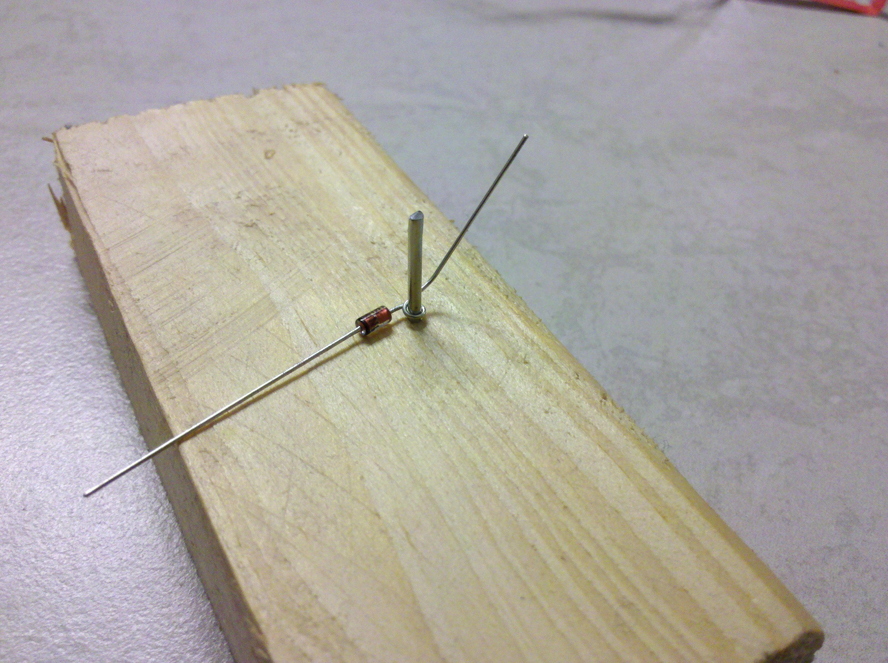
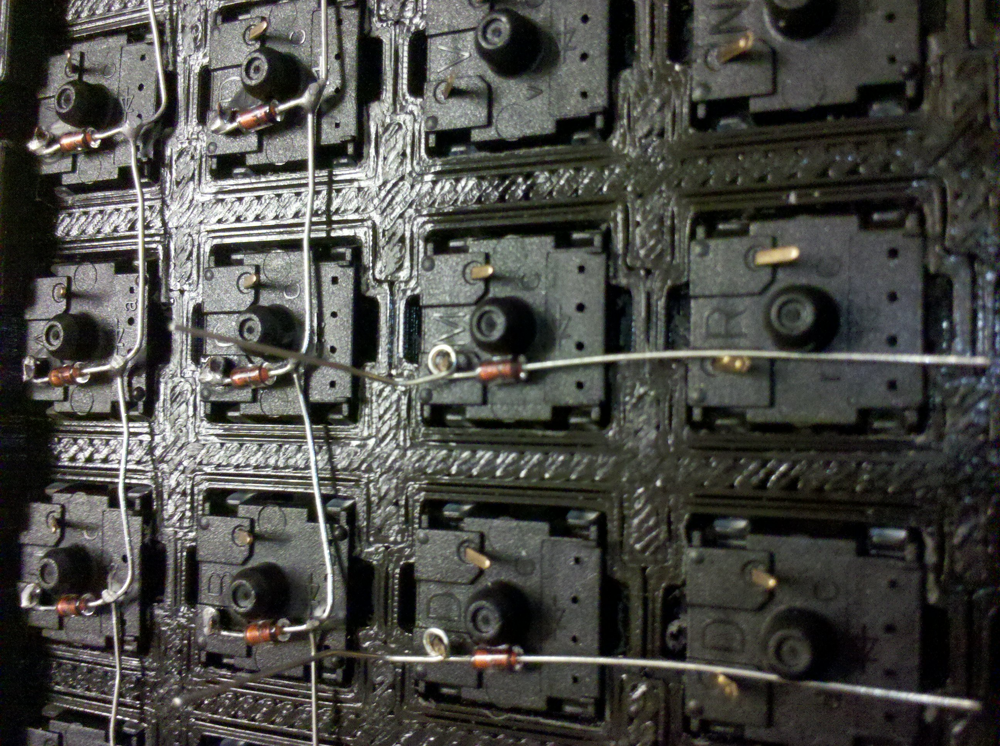
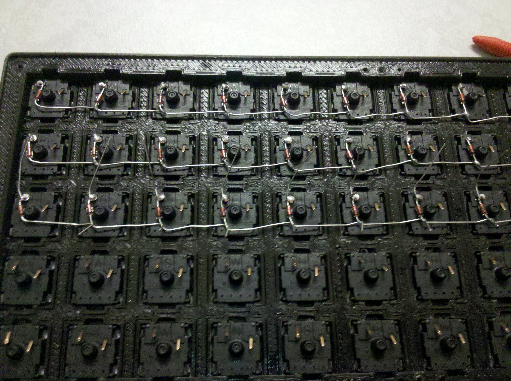
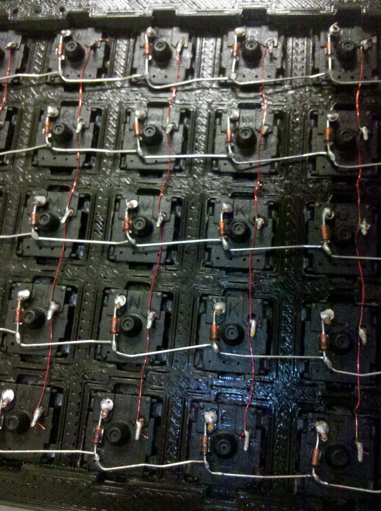
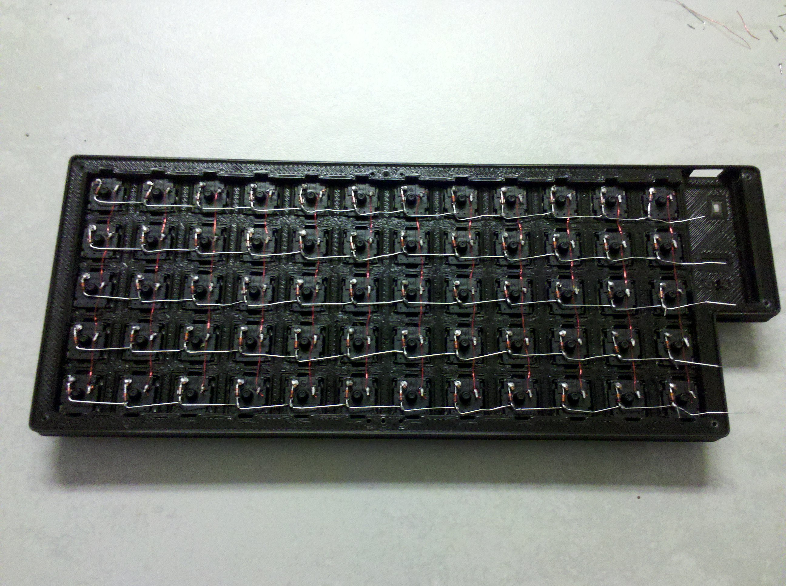

# Building instructions

## Shopping list

For this project, you'll need
 - 60 Cherry MX compatible switches;
 - 60 1u keycaps;
 - 60 1N4148 diodes;
 - 1 1.8kΩ resistor;
 - a [blue pill board](https://wiki.stm32duino.com/index.php?title=Blue_Pill) featuring a STM32F103C8 microcontroller (20KiB RAM, 64 KiB flash, ARM Cortex M3 @72MHz);
 - a micro USB cable;
 - a [3D printed case](cad/);
 - 7 2mm wood screws;
 - soldering set;
 - multimeter.
 
You also need a ST-Link v2 to flash and debug.
 
You can find everything on [Aliexpress](https://my.aliexpress.com/wishlist/wish_list_product_list.htm?currentGroupId=100000010426396) for about $50 without the case, soldering iron and multimeter.

## Printing the case

You can directly print the [case](cad/case.stl) and the [back](cad/back.stl). You'll need a printed that can print a 250mm wide piece. Else, you can try the 2 part design but be aware that It's not tested.

If you want to change the size of the grid, you can edit the [source file](cad/case.scad). The number of row and columns are at the begining of the file. Just change that to whatever you want (at least 3 rows and 1 columns). With make and openscad installed, you can just type `make` in the `cad/` directory to regenerate the STL files.

Not support is needed. I print with 20% infill and 0.2mm layers.

## Compiling and flashing

For compiling and flashing, please refer to [the blue pill quickstart](https://github.com/TeXitoi/blue-pill-quickstart/blob/master/README.md).

Basically:

```shell
curl https://sh.rustup.rs -sSf | sh
rustup target add thumbv7m-none-eabi
sudo apt-get install gdb-arm-none-eabi openocd
cd keyberon
# connect ST-Link v2 to the blue pill and the computer
# openocd in another terminal
cargo run --release
```

Now, If you connect the blue pill board to a computer using the micro USB port, the computer should detect a keyboard. You can test it by pushing the caps lock key on your keyboard, the green led of the blue pill should light up. You can also simulate a button press by connecting PA7 and PA8, your computer should register a space key press.

As the blue pill [doesn't respect the USB specifications](https://wiki.stm32duino.com/index.php?title=Blue_Pill#Hardware_installation), you need to fix it. Even if that's working on your computer, you'll want that your keyboard works everywhere. A 1.8kΩ resistor between PA12 and 3.3V can do the job.

## Building the keyboard

First, screw the back and the case to tap the holes. It's easier to do that first when the swiches are not mounted. Remove the back.

Place the swiches. The hole for the LED should be on your side when you tap on the keyboard. Be sure that the switches are not to tight, else the switch will not take its position after a key press. Sand the hole if it is too tight.

Now, you have to solder the diodes.



Create a loop on the diode. I use a nail on some piece of wood for that. The loop is on the anode (the leg at the opposite side of the black mark).



Place the diode on the left pin of the switch after bending the pin down (the pins must not be higher that the plot of the swich, else they will touch the back of the case). Place a complete row, and then solder on the loop.



Bend the cathode legs as on the photo. Solder the cathodes together. Cut the useless wires except the rightmost cathode cross.



Take a piece of polyurethane-enameled copper wire a bit longer than a column. Do 2 turns arround the right pin of the lowest switch of the column. Pass the wire under the cathode line. 2 turn arround the next switch. pass under the cathode line... for the whole column. Solder the loops. Cut the excess of wire.

You should now have something like that:



Check the connections with the multimeter in Ohmmeter mode: ground on a cathode line. Touch a column: no connection. Press the switch at the intersection of the column and row: connection. Test for each switch, correcting the bad contact if it's not working.

Now, connect the rows and columns to the blue pill:
 - Row 1 (top): PB11
 - Row 2: PB10
 - Row 3: PB1
 - Row 4: PB0
 - Row 5 (bottom): PA7
 - Column 1 (left on the switch side, right on the wire side): PB12
 - Column 2: PB13
 - Column 3: PB14
 - Column 4: PB15
 - Column 5: PA8
 - Column 6: PA9
 - Column 7: PA10
 - Column 8: PB5
 - Column 9: PB6
 - Column 10: PB7
 - Column 11: PB8
 - Column 12 (right on the switch side, left on the wire side): PB9

First solder the wires on the blue pill and cut the excess of wire. Then, solder the 1.8kΩ resistor between PA12 and 3.3V. put the blue pill to its pocket. Solder the wires to the matrix. For the columns, do a loop arround the uncutted cathode cross and melt the solder. For the rows, do a loop arround a row pin and remelt the solder.

Cut the excess of wire and the last cathode crosses.

You should now have something like that:


Plug to a computer a check each switch (switch with layer switching will not generate an event, you'll need to touch another switch to gen an event on the computer. Fix the possibly broken connections.

You're done! Screw the back, put the keycaps and start typing!
