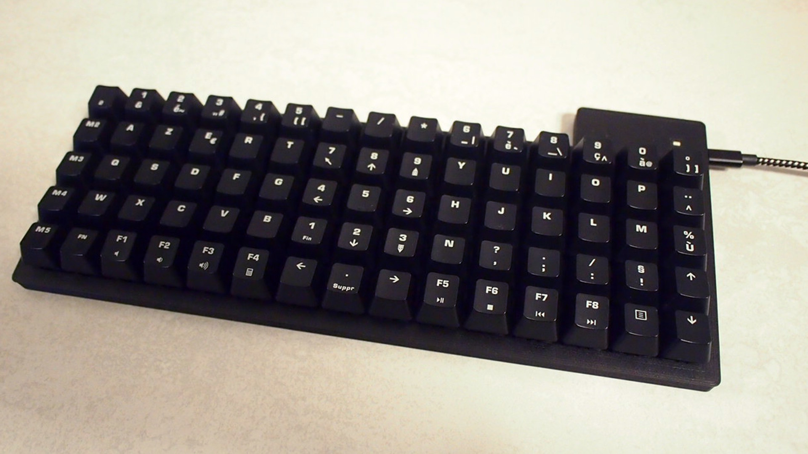

# Keyberon [](https://travis-ci.org/TeXitoi/keyberon)

A hand wired ortholinear mechanical keyboard with a firmware in pure Rust. The case uses a parametric design allowing to create a grid keyboard of any size. The firmware allows you to customize each key as you wish: A layer change (as the function key), a key combo (as one key for the paste shortcut) or a regular key.




You can [build](BUILDING.md) this keyboard yourself quite easily.

## The case

The [OpenSCad files](cad/) are a totally parametric design. You can generate a grid of keys of any size by modifying the parameters. It is designed to be as low as possible.

## The firmware

The firmware is written in the [rust programming language](https://rust-lang.org). It is not (yet) as feature full, robust and portable as [QMK](https://github.com/qmk/qmk_firmware).

It currently support:
 - Layers when holding a key (aka the fn key). When holding multiple layer keys, the numbers add (if you have a layer 1 key and a layer 2 key, when holding the 2 together, the layer 3 will be active).
 - Transparent key, i.e. when on a alternative layer, the key have the same behavior of the default layer.
 - Change default layer dynamically.
 - Multiple keys send on an single key press. It allows to have keys for complex shortcut, as a key for copy and paste, for alt tab, or for whatever you want.

# FAQ

## I want to use your 3D printed case, but I want to use a rock solid firmware

[QMK](https://github.com/qmk/qmk_firmware) supports the blue pill board. You may have to search a bit, but it should not be so complicated. See for example the [BluePill handwired](https://github.com/qmk/qmk_firmware/tree/master/keyboards/handwired/bluepill). Maybe the [firmwares from Cannon Keys](https://github.com/qmk/qmk_firmware/tree/master/keyboards/cannonkeys) can also be interesting. If you do any progress on this side, feel free to open a PR to share your experience.

## I want to use your rust firmware, but not your case

You have basically 2 options: hand wire your keyboard with your case (using a plate and case from the market should be OK as long as you can find a place for the blue pill and the USB connector), or you can buy a PCB with support for a STM32F103 micro-controller, as this is the only micro-controller that have a USB stack in rust at the time of writing. [Cannon Keys](https://cannonkeys.com/) proposes PCB that use the blue pill as the micro-controller, and thus should be fully compatible with the Keyberon firmware (modulo a pin modification, and without support for LED).

Please open a PR if you try anything on this side.

## Keyberon, what's that name?

To find new, findable and memorable project names, some persons in the rust community try to mix the name of a city with some keyword related to the project. For example, you have the [Tokio project](https://tokio.rs/) that derive its name from the Japanese capital Tokyo and IO for Input Output, the main subject of this project.

So, I have to find such a name. In the mechanical keyboard community, "keeb" is slang for keyboard. Thus, I searched for a city with the sound [kib], preferably in France as it is the country of origin of the project. I found [Quiberon](https://en.wikipedia.org/wiki/Quiberon), and thus I named the project Keyberon.

## What is this black and white pattern on your keyboard?

I'm fascinated by [isomorphic keyboards](https://en.wikipedia.org/wiki/Isomorphic_keyboard). Thus, I've searched a bit which vectors can do a great isomorphic keyboard on a 12x5 grid. After some trial and errors, I found that a major third left, and a minor third up is promising. Then, searching for an origin, I found one that do a great symmetry on the home row using the colors of the piano keys.

So, the black keys on the home row are G#, the whites at left of G# are C, and the whites above G# are B, and so on.

My keyboard doesn't (yet) play any music, that's purely aesthetics.

## What's the layout

As an old user of the [TypeMatrix 2030](http://www.typematrix.com/2030/features.php), the layout is quite close of the layout of the TypeMatrix. I also maximize the use of the thumbs by having shift, space, enter, alt, alt gr, gui and backspace on the thumbs.

Layer 0:
```
┌────┬────┬────┬────┬────┬────╥────┬────┬────┬────┬────┬────┐
│ ~  │ !  │ @  │ #  │ $  │ %  ║ ^  │ &  │ *  │ (  │ )  │ _  │
│ `  │ 1  │ 2  │ 3  │ 4  │ 5  ║ 6  │ 7  │ 8  │ 9  │ 0  │ -  │
├────┼────┼────┼────┼────┼────╫────┼────┼────┼────┼────┼────┤
│ ↹  │ Q  │ W  │ E  │ R  │ T  ║ Y  │ U  │ I  │ O  │ P  │ {  │
│    │    │    │    │    │    ║    │    │    │    │    │ [  │
├────┼────┼────┼────┼────┼────╫────┼────┼────┼────┼────┼────┤
│ }  │ A  │ S  │ D  │ F  │ G  ║ H  │ J  │ K  │ L  │ :  │ "  │
│ ]  │    │    │    │    │    ║    │    │    │    │ ;  │ '  │
├────┼────┼────┼────┼─══─┼────╫────┼─══─┼────┼────┼────┼────┤
│ +  │ Z  │ X  │ C  │ V  │ G  ║ N  │ M  │ <  │ >  │ ?  │ |  │
│ =  │    │    │    │    │    ║    │    │ ,  │ .  │ /  │ \  │
├────┼────┼────┼────┼────┼────╫────┼────┼────┼────┼────┼────┤
│Ctrl│L(1)│ GUI│ Alt│ ␣  │ ⇧  ║ ⇧  │ ⏎  │ Alt│ ⌫  │Esc.│Ctrl│
│    │    │    │    │    │    ║    │    │    │    │    │    │
└────┴────┴────┴────┴────┴────╨────┴────┴────┴────┴────┴────┘
```
Legend:
 - L(1): layer 1 when pressed

Layer 1:
```
┌────┬────┬────┬────┬────┬────╥────┬────┬────┬────┬────┬────┐
│ F1 │ F2 │ F3 │ F4 │ F5 │ F6 ║ F7 │ F8 │ F9 │ F10│ F11│ F12│
│    │    │    │    │    │    ║    │    │    │    │    │    │
├────┼────┼────┼────┼────┼────╫────┼────┼────┼────┼────┼────┤
│Esc.│    │    │    │    │    ║    │    │    │    │    │ ⇞  │
│    │    │    │    │    │    ║    │    │    │    │    │    │
├────┼────┼────┼────┼────┼────╫────┼────┼────┼────┼────┼────┤
│D(0)│D(1)│    │    │    │    ║    │ ◄  │ ▼  │ ▲  │ ►  │ ⇟  │
│    │    │    │    │    │    ║    │    │    │    │    │    │
├────┼────┼────┼────┼─══─┼────╫────┼─══─┼────┼────┼────┼────┤
│ ⇪  │Del.│ Cut│Copy│Past│    ║    │    │    │ ⇱  │ ▲  │ ⇲  │
│    │    │    │    │    │    ║    │    │    │    │    │    │
├────┼────┼────┼────┼────┼────╫────┼────┼────┼────┼────┼────┤
│    │    │    │    │    │    ║    │    │    │ ◄  │ ▼  │ ►  │
│    │    │    │    │    │    ║    │    │    │    │    │    │
└────┴────┴────┴────┴────┴────╨────┴────┴────┴────┴────┴────┘
```
Legend:
 - D(X): change default layer to X


I use the [bépo layout](https://bepo.fr), so this is what I have when I type:
```
┌────┬────┬────┬────┬────┬────╥────┬────┬────┬────┬────┬────┐
│ #  │ 1  │ 2  │ 3  │ 4  │ 5  ║ 6  │ 7  │ 8  │ 9  │ 0  │ °  │
│ $  │ " —│ « <│ » >│ ( [│ ) ]║ @ ^│ +  │ -  │ /  │ *  │ =  │
├────┼────┼────┼────┼────┼────╫────┼────┼────┼────┼────┼────┤
│ ↹  │ B  │ É  │ P  │ O  │ È  ║ !  │ V  │ D  │ L  │ J  │ Z  │
│    │   |│    │   &│   œ│    ║ ^  │    │    │    │    │    │
├────┼────┼────┼────┼────┼────╫────┼────┼────┼────┼────┼────┤
│ W  │ A  │ U  │ I  │ E  │ ;  ║ C  │ T  │ S  │ N  │ R  │ M  │
│    │   æ│   ù│   ¨│   €│ ,  ║    │    │    │    │    │    │
├────┼────┼────┼────┼─══─┼────╫────┼─══─┼────┼────┼────┼────┤
│ `  │ À  │ Y  │ X  │ :  │ K  ║ ?  │ Q  │ G  │ H  │ F  │ Ç  │
│ %  │   \│   {│   }│ . …│   ~║ '  │    │    │    │    │    │
├────┼────┼────┼────┼────┼────╫────┼────┼────┼────┼────┼────┤
│Ctrl│L(1)│ GUI│ Alt│nbsp│ ⇧  ║ ⇧  │ ⏎  │Alt │ ⌫  │Esc.│Ctrl│
│    │    │    │    │ ␣ _│    ║    │    │  Gr│    │    │    │
└────┴────┴────┴────┴────┴────╨────┴────┴────┴────┴────┴────┘
```

Legend:
 - L(1): layer 1 when pressed

You can of course tune the layout as you wish easily.
